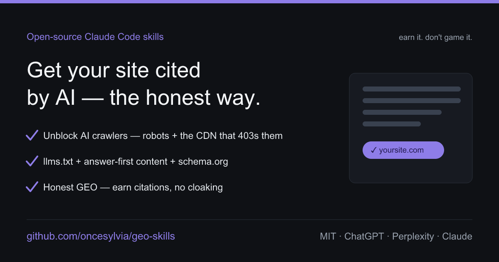

# GEO Skills



Open-source [Claude Code](https://claude.com/claude-code) skills to get your
business **found, cited, and correctly represented by AI** — ChatGPT, Perplexity,
Claude, Gemini, and AI search — then turn that visibility into customers. Works
whether you're a tech startup with a dev team **or** a small-business / export
owner with no developer at all.

Most "AI never mentions me" problems are boring and fixable: the crawler is
blocked at your CDN, your answer is trapped in an image or JavaScript, your
listing is thin, or the citation lives on a Reddit thread you're not part of. The
bigger risks: AI describes you **wrongly**, or cites you but you don't **convert**.
These skills cover the whole surface, the **honest** way — no cloaking, no fake
reviews, no prompt-injection tricks (those get you penalized).

## Two ways to start

- **Have a developer / technical site?** → start with **[geo-audit](skills/geo-audit/SKILL.md)**.
- **No dev team — small business, store on a marketplace, factory/外贸, non-technical?**
  → start with **[geo-starter](skills/geo-starter/SKILL.md)** (no code needed).

The three gates an AI engine needs: **reach** (it can fetch you), **parse** (your
answer is readable text), **trust** (you're credible — on your own surfaces *and*
in the places AI trusts). Engines differ — see
[ai-engines.md](shared/references/ai-engines.md). Enterprise decisions (bot/IP
policy, misinformation response, ownership) are in
[geo-governance.md](shared/references/geo-governance.md).

## Is this for you? / 这套适合你吗?

**Use it if 👇:** AI doesn't mention you but cites competitors · AI says something
**wrong** about you · AI sends traffic that doesn't convert · you sell on
Amazon/Alibaba/社媒 with no real website · you're a factory/外贸 wanting overseas
buyers to find you · you're going global or local — and you want it done honestly.

**Maybe skip it if 👇:** you only care about classic Google ranking, not AI
answers · you want to trick AI into recommending you (this toolkit refuses that).

## Skills (21, grouped by job)

**🧑‍💼 No dev team / small business / 出海 — start here**
| Skill | Use it when… |
|---|---|
| **[geo-starter](skills/geo-starter/SKILL.md)** | Non-technical → the 80/20 + no-code how-to for Shopify/Wix/WordPress/etc. |
| **[marketplace-and-social-geo](skills/marketplace-and-social-geo/SKILL.md)** | Your "site" is Amazon/Alibaba/LinkedIn/社媒 → make those AI-quotable & consistent |
| **[export-supplier-geo](skills/export-supplier-geo/SKILL.md)** | Factory/外贸 → get found & trusted by overseas buyers' AI (trade platforms, certs, English entity) |
| **[hire-and-brief-geo](skills/hire-and-brief-geo/SKILL.md)** | Must outsource → brief it right, spot scams, verify the work (don't get ripped off) |

**🟢 Get found & cited — your own site**
| Skill | Use it when… |
|---|---|
| **[geo-audit](skills/geo-audit/SKILL.md)** | "Why doesn't AI cite my site?" → 3-gate audit + fixes |
| **[ai-crawler-access](skills/ai-crawler-access/SKILL.md)** | AI bots get 403 → robots.txt **and** the CDN/WAF that silently blocks them |
| **[technical-foundations](skills/technical-foundations/SKILL.md)** | Reachable but invisible → sitemap/IndexNow, JS rendering, speed, freshness |
| **[answer-ready-content](skills/answer-ready-content/SKILL.md)** | A page exists but AI cites a rival → answer-first + schema |
| **[citable-pages](skills/citable-pages/SKILL.md)** | Missing the page types AI lifts (vs / alternatives / glossary / use-case) |
| **[topical-authority](skills/topical-authority/SKILL.md)** | AI cites big sites, not you → content clusters + E-E-A-T |
| **[llms-txt](skills/llms-txt/SKILL.md)** | Add a correct `/llms.txt` |

**🟢 Off your site** · **🔵 Defense**
| Skill | Use it when… |
|---|---|
| **[earn-mentions](skills/earn-mentions/SKILL.md)** | AI cites Reddit/reviews/roundups → honest off-site presence |
| **[ai-brand-monitor](skills/ai-brand-monitor/SKILL.md)** | AI says wrong price/features or confuses you with a rival → fix the source |

**🟣 Strategy & measurement** · **🟡 Outcome**
| Skill | Use it when… |
|---|---|
| **[prompt-coverage](skills/prompt-coverage/SKILL.md)** | Map the buyer prompt space + share-of-voice vs competitors |
| **[geo-measure](skills/geo-measure/SKILL.md)** | Track citations, AI referral traffic, bot crawls — trend, not a rank |
| **[citation-gap](skills/citation-gap/SKILL.md)** | Reverse-engineer why a rival gets cited + catch-up plan |
| **[geo-scorecard](skills/geo-scorecard/SKILL.md)** | Turn the audit into a 0-100 GEO score (4 dimensions) + a shareable scorecard image — real data, estimates labeled |
| **[convert-ai-traffic](skills/convert-ai-traffic/SKILL.md)** | AI sends visits but no conversions → match the answer, capture, attribute |

**🌏 Local & international** · **🟠 Frontier**
| Skill | Use it when… |
|---|---|
| **[local-ai-search](skills/local-ai-search/SKILL.md)** | "near me" / local → Google Business Profile, NAP consistency, local schema |
| **[international-geo](skills/international-geo/SKILL.md)** | Multiple languages/countries (出海) → hreflang, real localization, regional engines |
| **[agent-ready](skills/agent-ready/SKILL.md)** | Be not just cited but **transactable** by AI agents |

The most common single fix is **ai-crawler-access** — people fix robots.txt but
leave Cloudflare's "Block AI bots" toggle on, so AI gets a 403 and never sees the
site.

## Install

```
/plugin marketplace add oncesylvia/geo-skills
/plugin install geo-skills@geo-skills
```

Then ask naturally — "I'm not technical, where do I start", "Cloudflare is
blocking GPTBot", "what does ChatGPT say about my company", "help overseas buyers
find my factory", "is this SEO agency legit", "AI sends traffic but no sales".

## Honest GEO only

GEO has a dark side (cloaking, AI-slop, fake schema, fake reviews, hidden prompt
injection). This toolkit refuses all of it — see
[geo-principles.md](shared/references/geo-principles.md). Results are
probabilistic: we fix the inputs and never promise a ranking. Same ethos as my
other tools: help you do it right, not get burned.

## Bilingual / 出海 (中文)

中英双语,贯穿每个 skill。覆盖全球 AI 与国内引擎(豆包/文心/元宝)、CDN 静默 403
的坑、国内站外信任源(知乎/小红书/百度百科)、国内本地(高德/百度地图/大众点评)、
不懂代码的小老板上手路径、阿里/1688/社媒门面、**外贸工厂被海外买家 AI 发现**、
多市场 hreflang、把 AI 流量变成订单,以及"外包不被坑"。

## Why I built this

I run [cocodot](https://cocodot.co) and went through this myself: AI search
couldn't see the site, and the cause wasn't content — it was the CDN quietly
blocking AI bots behind a toggle nobody mentions. So I wrote down the honest
playbook and kept going until it covered what a real business needs — whether
you're a startup with engineers or a small owner / 外贸 boss with none.

## Related projects

- [**fundraising-skills**](https://github.com/oncesylvia/fundraising-skills) — Claude Code skills for founder-led fundraising.
- [**LLMprobe**](https://github.com/oncesylvia/LLMprobe) — CLI to catch LLM API model-downgrading (降智) and benchmark providers.

## License

MIT. Use it, fork it, improve it.
